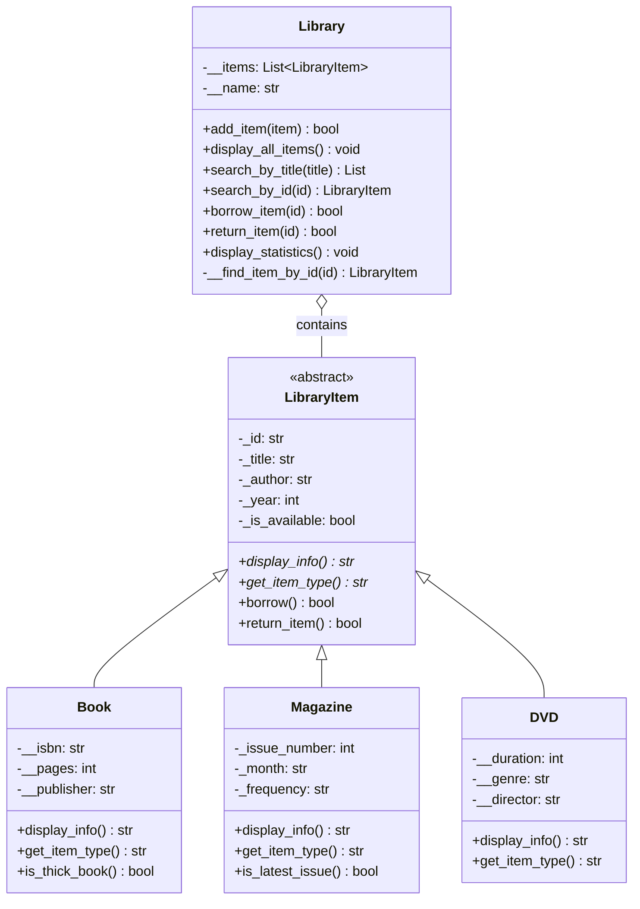

## 👨‍💻 Pembuat

- **Nama**: Andryano Shevchenko Limbong
- **NIM**: 123140205
- **Kelas**: RA
- **Mata Kuliah**: Pengembangan Aplikasi Website
- **Tahun**: 2025

---

## 📞 Kontak & Support

Jika ada pertanyaan, saran, atau menemukan bug:

Jika ada pertanyaan atau saran, silakan hubungi:
- **Email**: [andryanoshevchenkolimbong@gmail.com]
- **GitHub**: [github.com/cengkooo]

## 📷 Screenshot
Screenshot hasil running program

1. assets\image.png
2. assets\image-1.png
3. assets\image-2.png
4. assets\image-3.png
5. assets\image-4.png
6. assets\image-5.png
7. assets\image-6.png
8. assets\image-7.png


2.
---

# 📚 Sistem Manajemen Perpustakaan Sederhana (OOP)

Program manajemen perpustakaan berbasis Object-Oriented Programming (OOP) menggunakan Python. Program ini mendemonstrasikan implementasi konsep OOP seperti Abstract Class, Inheritance, Encapsulation, dan Polymorphism.


---

## 📊 Kriteria Penilaian

### Tabel Penilaian

| No | Aspek | Bobot | Status | Penjelasan |
|----|-------|-------|--------|------------|
| 1 | **Abstract Class & Inheritance** | 30% | ✅ **Terpenuhi** | - LibraryItem sebagai ABC dengan 2 abstract methods<br>- 3 subclass (Book, Magazine, DVD) inherit dari LibraryItem<br>- Semua subclass implement abstract methods |
| 2 | **Encapsulation** | 25% | ✅ **Terpenuhi** | - Protected attributes (`_attribute`)<br>- Private attributes (`__attribute`)<br>- Property decorators dengan getter/setter<br>- Private methods di Library class |
| 3 | **Polymorphism** | 20% | ✅ **Terpenuhi** | - Method overriding (display_info berbeda tiap subclass)<br>- Duck typing (Library accepts any LibraryItem)<br>- Computed properties |
| 4 | **Fungsionalitas Program** | 15% | ✅ **Terpenuhi** | - Add, display, search items<br>- Borrow & return system<br>- Statistics & analytics<br>- Interactive menu |
| 5 | **Dokumentasi Kode** | 10% | ✅ **Terpenuhi** | - Docstring lengkap semua class & method<br>- Komentar konsep OOP<br>- Type hints<br>- README comprehensive |

**Total: 100%** ✅

---

### Detail Pemenuhan Kriteria

#### ✅ 1. Abstract Class & Inheritance (30%)

**Implementasi:**
- ✔️ `LibraryItem` sebagai Abstract Base Class menggunakan `ABC` dan `@abstractmethod`
- ✔️ Dua abstract methods: `display_info()` dan `get_item_type()`
- ✔️ Tiga subclass yang inherit: `Book`, `Magazine`, `DVD`
- ✔️ Setiap subclass implement semua abstract methods dengan cara berbeda
- ✔️ Menggunakan `super()` untuk memanggil constructor parent class

**Bukti Kode:**
```python
from abc import ABC, abstractmethod

class LibraryItem(ABC):
    @abstractmethod
    def display_info(self) -> str:
        pass

class Book(LibraryItem):
    def __init__(self, ...):
        super().__init__(...)  # Call parent constructor
    
    def display_info(self) -> str:
        # Implementation untuk Book
        return "..."
```

---

#### ✅ 2. Encapsulation (25%)

**Implementasi:**
- ✔️ **Protected attributes** (`_attribute`): Digunakan di `LibraryItem` untuk data yang perlu diakses subclass
- ✔️ **Private attributes** (`__attribute`): Digunakan di `Book`, `DVD` untuk data sensitif
- ✔️ **Property decorators**: Minimal 5 properties dengan getter
- ✔️ **Setter dengan validasi**: Property `title` dengan validasi
- ✔️ **Private methods**: `__find_item_by_id()` di Library class

**Bukti Kode:**
```python
class LibraryItem:
    def __init__(self, ...):
        self._id = item_id        # Protected
        self._title = title       # Protected
    
    @property
    def title(self) -> str:
        return self._title
    
    @title.setter
    def title(self, value: str):
        if not value:
            raise ValueError("...")
        self._title = value

class Book(LibraryItem):
    def __init__(self, ...):
        self.__isbn = isbn        # Private
        self.__pages = pages      # Private
```

---

#### ✅ 3. Polymorphism (20%)

**Implementasi:**
- ✔️ **Method Overriding**: `display_info()` berbeda untuk Book, Magazine, DVD
- ✔️ **Duck Typing**: Library menerima semua tipe LibraryItem
- ✔️ **Dynamic Dispatch**: Memanggil method yang sesuai dengan tipe object runtime
- ✔️ **Computed Properties**: `total_items`, `available_items`

**Bukti Kode:**
```python
# Polymorphism - method yang sama, perilaku berbeda
book.display_info()      # Format untuk buku
magazine.display_info()  # Format untuk majalah
dvd.display_info()       # Format untuk DVD

# Duck typing - menerima berbagai tipe
library.add_item(book)      # OK
library.add_item(magazine)  # OK
library.add_item(dvd)       # OK
```

---

#### ✅ 4. Fungsionalitas Program (15%)

**Implementasi:**
- ✔️ **CRUD Operations**: Create (add), Read (display/search), Update (borrow/return)
- ✔️ **Search Functionality**: By title dan by ID
- ✔️ **Status Management**: Track ketersediaan item
- ✔️ **Statistics**: Analisis data perpustakaan
- ✔️ **User Interface**: Menu interaktif yang user-friendly

**Fitur Lengkap:**
1. Tambah item ke perpustakaan
2. Tampilkan semua item (grouped by type)
3. Cari berdasarkan judul (partial match)
4. Cari berdasarkan ID (exact match)
5. Pinjam item (dengan validasi)
6. Kembalikan item
7. Tampilkan detail lengkap
8. Statistik perpustakaan

---

#### ✅ 5. Dokumentasi Kode (10%)

**Implementasi:**
- ✔️ **Docstring**: Setiap class dan method punya docstring
- ✔️ **Komentar**: Menjelaskan konsep OOP yang diterapkan
- ✔️ **Type Hints**: Parameter dan return types semua jelas
- ✔️ **README**: Dokumentasi lengkap dengan diagram dan contoh

**Contoh Dokumentasi:**
```python
def search_by_title(self, title: str) -> List[LibraryItem]:
    """
    Mencari item berdasarkan judul (case-insensitive, partial match)
    
    Args:
        title: Kata kunci judul
        
    Returns:
        List item yang cocok
    """
```

---

## 🎓 Konsep OOP yang Dipelajari

### 1. Abstraction
- Menyembunyikan kompleksitas implementasi
- Hanya menampilkan interface yang relevan
- Abstract class tidak bisa diinstansiasi

### 2. Inheritance
- Reusability kode
- Hierarki class yang jelas
- Pewarisan attributes dan methods

### 3. Encapsulation
- Melindungi data dari akses langsung
- Kontrol akses melalui methods
- Data hiding dengan private/protected

### 4. Polymorphism
- Satu interface, banyak implementasi
- Method overriding
- Duck typing di Python

---

## 🔧 Troubleshooting

### Error: "Can't instantiate abstract class"
**Penyebab:** Mencoba membuat instance `LibraryItem` langsung.

**Solusi:** Gunakan subclass (Book, Magazine, atau DVD).
```python
# ❌ Salah
item = LibraryItem("ID", "Title", ...)

# ✅ Benar
item = Book("ID", "Title", ...)
```

---

### Error: "AttributeError: ... has no attribute '__isbn'"
**Penyebab:** Mencoba akses private attribute dari luar class.

**Solusi:** Gunakan property getter.
```python
# ❌ Salah
print(book.__isbn)

# ✅ Benar
print(book.isbn)  # Menggunakan property
```

---

### Error: "TypeError: ... is not an instance of LibraryItem"
**Penyebab:** Mencoba add item yang bukan LibraryItem.

**Solusi:** Pastikan object adalah subclass dari LibraryItem.
```python
# ❌ Salah
library.add_item("Not an object")

# ✅ Benar
book = Book(...)
library.add_item(book)
```

---

## 🚀 Pengembangan Lebih Lanjut

### Fitur yang Bisa Ditambahkan

1. **Persistent Storage**
   - Simpan data ke JSON/CSV
   - Load data dari file
   - Database integration (SQLite)

2. **User Management**
   - Class `Member` untuk anggota perpustakaan
   - Track siapa meminjam apa
   - Riwayat peminjaman

3. **Advanced Search**
   - Filter berdasarkan tahun
   - Filter berdasarkan penulis
   - Sort by various criteria

4. **Reservation System**
   - Reservasi item yang sedang dipinjam
   - Queue management
   - Notification system

5. **Late Fee Calculation**
   - Track tanggal peminjaman
   - Hitung denda keterlambatan
   - Payment tracking

6. **GUI Interface**
   - Tkinter untuk desktop app
   - Web interface dengan Flask/Django
   - Mobile app

7. **More Item Types**
   - `Journal` class
   - `Newspaper` class
   - `EBook` class
   - `AudioBook` class

8. **Analytics Dashboard**
   - Item paling populer
   - Statistik peminjaman
   - Visualisasi data

---

## 📝 Best Practices yang Diterapkan

### 1. SOLID Principles
- **S**ingle Responsibility: Setiap class punya tanggung jawab tunggal
- **O**pen/Closed: Mudah extend dengan subclass baru
- **L**iskov Substitution: Subclass bisa replace parent class
- **I**nterface Segregation: Abstract methods focused dan minimal
- **D**ependency Inversion: Library depends on abstraction (LibraryItem)

### 2. Clean Code
- Nama variabel dan method yang deskriptif
- Fungsi kecil dan focused
- Komentar yang meaningful
- Consistent formatting

### 3. Python Conventions
- PEP 8 style guide
- Type hints untuk clarity
- Docstring format yang konsisten
- Property decorators untuk encapsulation

---

## ❓ FAQ (Frequently Asked Questions)

### Q: Mengapa menggunakan Abstract Base Class?
**A:** ABC memaksa subclass untuk mengimplementasikan method tertentu, menjamin konsistensi interface dan mencegah error runtime.

### Q: Apa perbedaan protected (`_`) dan private (`__`)?
**A:** 
- **Protected (`_attribute`)**: Konvensi Python, bisa diakses subclass tapi tidak encouraged dari luar
- **Private (`__attribute`)**: Name mangling, lebih strict, hanya bisa diakses dalam class

### Q: Kapan menggunakan Property Decorator?
**A:** Gunakan ketika:
- Perlu validasi saat set value
- Ingin computed property
- Perlu logging/tracking akses
- Backward compatibility dengan attribute access

### Q: Bagaimana menambah tipe item baru?
**A:** Buat class baru yang inherit dari `LibraryItem` dan implement semua abstract methods:
```python
class Journal(LibraryItem):
    def display_info(self) -> str:
        # Implementation
        pass
    
    def get_item_type(self) -> str:
        return "Jurnal"
```

### Q: Bisakah mengubah data private dari luar class?
**A:** Secara teknis bisa dengan name mangling (`object._ClassName__attribute`), tapi **sangat tidak disarankan** karena melanggar encapsulation.

---

## 📖 Referensi & Sumber Belajar

### Dokumentasi Official
- [Python Official Docs - Classes](https://docs.python.org/3/tutorial/classes.html)
- [Python ABC Module](https://docs.python.org/3/library/abc.html)
- [Python Property Decorator](https://docs.python.org/3/library/functions.html#property)

### Tutorial & Articles
- Real Python - Object-Oriented Programming (OOP) in Python
- GeeksforGeeks - Python OOP Concepts
- Programiz - Python OOP

### Books
- "Python Object-Oriented Programming" by Steven F. Lott
- "Fluent Python" by Luciano Ramalho
- "Clean Code in Python" by Mariano Anaya

---

## 🤝 Kontribusi

Program ini open untuk improvement. Jika ingin berkontribusi:

1. Fork repository
2. Buat branch baru (`git checkout -b feature/ImprovementName`)
3. Commit changes (`git commit -m 'Add some improvement'`)
4. Push ke branch (`git push origin feature/ImprovementName`)
5. Buat Pull Request

---

## 📄 Lisensi

Program ini dibuat untuk keperluan edukasi dan tugas praktikum. Bebas digunakan dan dimodifikasi untuk pembelajaran.

---

## 🙏 Ucapan Terima Kasih

Terima kasih kepada:
- Dosen pengampu mata kuliah yang telah memberikan bimbingan
- Teman-teman yang telah berdiskusi dan sharing knowledge
- Komunitas Python Indonesia
- Semua sumber referensi yang telah disebutkan

---

## 📅 Version History

### Version 1.0.0 (November 2024)
- ✅ Initial release
- ✅ Implementasi 4 konsep OOP utama
- ✅ 3 tipe item (Book, Magazine, DVD)
- ✅ Menu interaktif lengkap
- ✅ Dokumentasi comprehensive

### Planned Updates
- 🔄 Version 1.1.0: Add persistent storage (JSON)
- 🔄 Version 1.2.0: Add Member management
- 🔄 Version 2.0.0: GUI interface with Tkinter

---

## ⭐ Fitur Unggulan

### 🎯 Yang Membuat Program Ini Spesial:

1. **Full OOP Implementation**
   - Semua 4 pilar OOP diterapkan dengan benar
   - Code structure yang clean dan maintainable

2. **Type Safety**
   - Type hints di semua method
   - Runtime type checking

3. **Robust Error Handling**
   - Validasi input yang comprehensive
   - Error messages yang informatif

4. **User-Friendly Interface**
   - Menu yang intuitif
   - Output yang terformat dengan baik
   - Emoji untuk visual appeal 🎨

5. **Extensible Architecture**
   - Mudah menambah tipe item baru
   - Modular design

6. **Complete Documentation**
   - README yang detailed
   - Docstring di setiap method
   - Diagram class yang jelas

---

## 🎬 Kesimpulan

Program **Sistem Manajemen Perpustakaan** ini berhasil mengimplementasikan semua konsep OOP dengan:

✅ **Abstract Base Class** sebagai blueprint
✅ **Inheritance** untuk reusability
✅ **Encapsulation** untuk data protection
✅ **Polymorphism** untuk flexibility

Program ini tidak hanya memenuhi persyaratan tugas, tetapi juga mendemonstrasikan best practices dalam software development dengan Python.

---

<div align="center">

### 🌟 Terima Kasih 🌟

**Happy Coding!** 💻🚀

---

**Made with ❤️ and ☕ by Andryano Shevchenko Limbong**

Last Updated: 16 November 2025

---

## 🎯 Tentang Program

**Sistem Manajemen Perpustakaan** adalah aplikasi console-based yang memungkinkan pengelolaan koleksi perpustakaan digital. Program ini dibangun dengan fokus pada penerapan konsep Object-Oriented Programming (OOP) yang solid dan mudah dipahami.

### Tujuan Pembelajaran
- Memahami dan menerapkan **Abstract Base Class** (ABC)
- Mengimplementasikan **Inheritance** (pewarisan)
- Menerapkan **Encapsulation** untuk melindungi data
- Memanfaatkan **Polymorphism** untuk fleksibilitas kode
- Menggunakan **Property Decorators** untuk getter/setter
- Membuat struktur kode yang clean dan maintainable

---

## 🧩 Konsep OOP yang Diterapkan

### 1. 🎭 **Abstract Class & Abstraction** (30%)

**Abstract Base Class** `LibraryItem` menjadi blueprint untuk semua item perpustakaan:

```python
from abc import ABC, abstractmethod

class LibraryItem(ABC):
    @abstractmethod
    def display_info(self) -> str:
        """Setiap subclass HARUS mengimplementasikan method ini"""
        pass
    
    @abstractmethod
    def get_item_type(self) -> str:
        """Mengembalikan tipe item"""
        pass
```

**Keuntungan:**
- ✅ Memaksa subclass mengimplementasikan method tertentu
- ✅ Menjamin konsistensi interface
- ✅ Tidak bisa diinstansiasi secara langsung

---

### 2. 🔗 **Inheritance (Pewarisan)** (30%)

Tiga subclass mewarisi dari `LibraryItem`:

```python
class Book(LibraryItem):      # Mewarisi LibraryItem
    pass

class Magazine(LibraryItem):  # Mewarisi LibraryItem
    pass

class DVD(LibraryItem):       # Mewarisi LibraryItem
    pass
```

**Keuntungan:**
- ✅ Reusability kode (tidak menulis ulang)
- ✅ Hierarki yang jelas
- ✅ Mudah menambah tipe item baru

---

### 3. 🔒 **Encapsulation** (25%)

#### Protected Attributes (`_attribute`)
Digunakan untuk data yang bisa diakses oleh subclass:

```python
class LibraryItem:
    def __init__(self, item_id, title):
        self._id = item_id          # Protected
        self._title = title         # Protected
        self._is_available = True   # Protected
```

#### Private Attributes (`__attribute`)
Digunakan untuk data yang hanya bisa diakses dalam class tersebut:

```python
class Book(LibraryItem):
    def __init__(self, ...):
        self.__isbn = isbn          # Private
        self.__pages = pages        # Private
```

#### Property Decorators
Kontrol akses ke attributes dengan getter/setter:

```python
@property
def title(self) -> str:
    """Getter untuk title"""
    return self._title

@title.setter
def title(self, value: str):
    """Setter dengan validasi"""
    if not value:
        raise ValueError("Judul tidak boleh kosong")
    self._title = value
```

**Keuntungan:**
- ✅ Data terlindungi dari akses langsung
- ✅ Validasi data terpusat
- ✅ Mudah maintenance

---

### 4. 🎨 **Polymorphism** (20%)

#### Method Overriding
Setiap subclass mengimplementasikan `display_info()` dengan cara berbeda:

```python
# Book implementation
def display_info(self):
    return f"BUKU: {self._title} - {self.__isbn}"

# Magazine implementation
def display_info(self):
    return f"MAJALAH: {self._title} - Edisi #{self._issue_number}"

# DVD implementation
def display_info(self):
    return f"DVD: {self._title} - {self.__duration} menit"
```

#### Duck Typing
Library dapat menerima berbagai tipe item:

```python
library.add_item(book)      # OK
library.add_item(magazine)  # OK
library.add_item(dvd)       # OK
```

**Keuntungan:**
- ✅ Fleksibilitas tinggi
- ✅ Kode lebih generic
- ✅ Mudah extend

---

## 🏗️ Struktur Class

### Diagram Hierarki

```
┌─────────────────────────────┐
│   LibraryItem (Abstract)    │
│  ─────────────────────────  │
│  - _id: str                 │
│  - _title: str              │
│  - _author: str             │
│  - _year: int               │
│  - _is_available: bool      │
│  ─────────────────────────  │
│  + display_info()* [ABC]    │
│  + get_item_type()* [ABC]   │
│  + borrow(): bool           │
│  + return_item(): bool      │
└─────────────────────────────┘
           ▲
           │ (inherits)
           │
    ┌──────┴──────┬──────────────┐
    │             │              │
┌───▼────┐   ┌───▼─────┐   ┌───▼───┐
│  Book  │   │Magazine │   │  DVD  │
└────────┘   └─────────┘   └───────┘

┌─────────────────────────────┐
│        Library              │
│  ─────────────────────────  │
│  - __items: List[Item]      │
│  - __name: str              │
│  ─────────────────────────  │
│  + add_item()               │
│  + search_by_title()        │
│  + search_by_id()           │
│  + borrow_item()            │
│  + return_item()            │
│  + display_all_items()      │
│  + display_statistics()     │
└─────────────────────────────┘
```

---

## ⚡ Fitur Program

### 1. **Manajemen Item**
- ➕ **Tambah Item**: Menambahkan buku, majalah, atau DVD ke koleksi
- 📋 **Tampilkan Semua**: Melihat daftar lengkap item (dikelompokkan by tipe)
- 🔍 **Cari Item**: Mencari berdasarkan judul atau ID

### 2. **Sistem Peminjaman**
- 📚 **Pinjam Item**: Meminjam item yang tersedia
- 🔄 **Kembalikan Item**: Mengembalikan item yang dipinjam
- ✅ **Status Real-time**: Tracking ketersediaan item

### 3. **Informasi Detail**
- 📖 **Detail Buku**: ISBN, jumlah halaman, penerbit
- 📰 **Detail Majalah**: Nomor edisi, bulan publikasi, frekuensi
- 💿 **Detail DVD**: Durasi, genre, sutradara

### 4. **Analisis & Statistik**
- 📊 **Statistik Perpustakaan**: Total item, item tersedia, item dipinjam
- 📈 **Breakdown per Kategori**: Jumlah buku, majalah, DVD
- 🔢 **Computed Properties**: Perhitungan otomatis

---

## 📥 Instalasi & Menjalankan

### Persyaratan Sistem
- **Python**: 3.8 atau lebih tinggi
- **OS**: Windows, Linux, atau macOS
- **Library**: Hanya built-in Python (tidak perlu pip install)

### Langkah-langkah

#### 1. Clone/Download Repository
```bash
git clone https://github.com/username/library-management-oop.git
cd library-management-oop
```

#### 2. Jalankan Program
```bash
python library_management.py
```

#### 3. Alternatif: Jalankan dengan Python 3
```bash
python3 library_management.py
```

---

## 🚀 Cara Penggunaan

### Menu Utama

Setelah menjalankan program, Anda akan melihat menu:

```
============================================================
🏛️  SISTEM MANAJEMEN PERPUSTAKAAN UNIVERSITAS XYZ
============================================================
1. Tampilkan Semua Item
2. Cari Item berdasarkan Judul
3. Cari Item berdasarkan ID
4. Pinjam Item
5. Kembalikan Item
6. Tampilkan Detail Item
7. Tampilkan Statistik
8. Keluar
============================================================
Pilih menu (1-8): _
```

### Panduan Fitur

#### 🔹 Menu 1: Tampilkan Semua Item
Menampilkan seluruh koleksi perpustakaan yang dikelompokkan berdasarkan tipe (Buku, Majalah, DVD).

**Output:**
```
============================================================
📚 PERPUSTAKAAN UNIVERSITAS XYZ
============================================================
Total Item: 7 | Tersedia: 5
============================================================

📖 BUKU:
  [B001] Python Programming - John Smith (2023) - Tersedia
  [B002] Data Science Basics - Jane Doe (2022) - Tersedia
  [B003] Machine Learning - Alice Johnson (2024) - Dipinjam

📰 MAJALAH:
  [M001] Tech Monthly - Tech Media (2024) - Tersedia
  [M002] Science Today - Science Corp (2024) - Tersedia

💿 DVD:
  [D001] The Matrix - Warner Bros (1999) - Tersedia
  [D002] Inception - Warner Bros (2010) - Dipinjam

============================================================
```

---

#### 🔹 Menu 2: Cari Item berdasarkan Judul
Mencari item dengan kata kunci (case-insensitive, partial match).

**Contoh:**
```
Masukkan kata kunci judul: python

🔍 Ditemukan 1 item:
  [B001] Python Programming - John Smith (2023) - Tersedia
```

---

#### 🔹 Menu 3: Cari Item berdasarkan ID
Mencari item spesifik dengan ID unik.

**Contoh:**
```
Masukkan ID item: B001

============================================================
BUKU
============================================================
ID         : B001
Judul      : Python Programming
Penulis    : John Smith
Tahun      : 2023
ISBN       : 978-0-123456-78-9
Halaman    : 450
Penerbit   : Tech Publishers
Status     : ✓ Tersedia
============================================================
```

---

#### 🔹 Menu 4: Pinjam Item
Meminjam item dari perpustakaan.

**Contoh:**
```
Masukkan ID item yang akan dipinjam: B001
✅ Berhasil meminjam: Python Programming
```

**Jika item sudah dipinjam:**
```
Masukkan ID item yang akan dipinjam: B001
❌ Item 'Python Programming' sedang dipinjam.
```

---

#### 🔹 Menu 5: Kembalikan Item
Mengembalikan item yang dipinjam.

**Contoh:**
```
Masukkan ID item yang akan dikembalikan: B001
✅ Berhasil mengembalikan: Python Programming
```

---

#### 🔹 Menu 6: Tampilkan Detail Item
Menampilkan informasi lengkap item dengan fitur spesifik untuk setiap tipe.

**Contoh untuk Buku:**
```
Masukkan ID item: B003

============================================================
BUKU
============================================================
ID         : B003
Judul      : Machine Learning
Penulis    : Alice Johnson
Tahun      : 2024
ISBN       : 978-0-456789-12-3
Halaman    : 520
Penerbit   : AI Press
Status     : ✓ Tersedia
============================================================
📚 Ini adalah buku tebal (>300 halaman)
```

**Contoh untuk Majalah:**
```
Masukkan ID item: M001

============================================================
MAJALAH
============================================================
ID         : M001
Judul      : Tech Monthly
Editor     : Tech Media
Tahun      : 2024
Edisi      : #12
Bulan      : November
Frekuensi  : Bulanan
Status     : ✓ Tersedia
============================================================
🆕 Ini adalah edisi terbaru!
```

---

#### 🔹 Menu 7: Tampilkan Statistik
Menampilkan statistik lengkap perpustakaan.

**Output:**
```
============================================================
📊 STATISTIK PERPUSTAKAAN
============================================================
Nama Perpustakaan : Perpustakaan Universitas XYZ
Total Item        : 7
Item Tersedia     : 5
Item Dipinjam     : 2

Jumlah per Kategori:
  - Buku: 3
  - Majalah: 2
  - DVD: 2
============================================================
```

---

## 📸 Screenshot Program

### 1. Menu Utama
```
============================================================
🏛️  SISTEM MANAJEMEN PERPUSTAKAAN UNIVERSITAS XYZ
============================================================
1. Tampilkan Semua Item
2. Cari Item berdasarkan Judul
3. Cari Item berdasarkan ID
4. Pinjam Item
5. Kembalikan Item
6. Tampilkan Detail Item
7. Tampilkan Statistik
8. Keluar
============================================================
Pilih menu (1-8): 
```

### 2. Tampilan Semua Item (Menu 1)
```
============================================================
📚 PERPUSTAKAAN UNIVERSITAS XYZ
============================================================
Total Item: 7 | Tersedia: 5
============================================================

📖 BUKU:
  [B001] Python Programming - John Smith (2023) - Tersedia
  [B002] Data Science Basics - Jane Doe (2022) - Tersedia
  [B003] Machine Learning - Alice Johnson (2024) - Dipinjam

📰 MAJALAH:
  [M001] Tech Monthly - Tech Media (2024) - Tersedia
  [M002] Science Today - Science Corp (2024) - Tersedia

💿 DVD:
  [D001] The Matrix - Warner Bros (1999) - Tersedia
  [D002] Inception - Warner Bros (2010) - Dipinjam

============================================================
```

### 3. Pencarian Berdasarkan Judul (Menu 2)
```
Masukkan kata kunci judul: science

🔍 Ditemukan 2 item:
  [B002] Data Science Basics - Jane Doe (2022) - Tersedia
  [M002] Science Today - Science Corp (2024) - Tersedia
```

### 4. Detail Item Buku (Menu 6)
```
============================================================
BUKU
============================================================
ID         : B001
Judul      : Python Programming
Penulis    : John Smith
Tahun      : 2023
ISBN       : 978-0-123456-78-9
Halaman    : 450
Penerbit   : Tech Publishers
Status     : ✓ Tersedia
============================================================
📚 Ini adalah buku tebal (>300 halaman)
```

### 5. Proses Peminjaman (Menu 4)
```
Masukkan ID item yang akan dipinjam: B001
✅ Berhasil meminjam: Python Programming

Masukkan ID item yang akan dipinjam: B001
❌ Item 'Python Programming' sedang dipinjam.
```

### 6. Statistik Perpustakaan (Menu 7)
```
============================================================
📊 STATISTIK PERPUSTAKAAN
============================================================
Nama Perpustakaan : Perpustakaan Universitas XYZ
Total Item        : 7
Item Tersedia     : 5
Item Dipinjam     : 2

Jumlah per Kategori:
  - Buku: 3
  - Majalah: 2
  - DVD: 2
============================================================
```

---

## 📐 Diagram Class

### Class Hierarchy Diagram



### Penjelasan Diagram

#### Relationships:
- **Inheritance** (`<|--`): Book, Magazine, dan DVD mewarisi dari LibraryItem
- **Composition** (`o--`): Library memiliki koleksi LibraryItem

#### Access Modifiers:
- `+` Public: Bisa diakses dari luar class
- `-` Private: Hanya bisa diakses dari dalam class
- `*` Abstract: Method yang harus diimplementasikan subclass

---

### Detailed Class Diagram

```
┌──────────────────────────────────────────────────────────┐
│              LibraryItem (Abstract Base Class)           │
├──────────────────────────────────────────────────────────┤
│ Protected Attributes:                                    │
│  - _id: str                                              │
│  - _title: str                                           │
│  - _author: str                                          │
│  - _year: int                                            │
│  - _is_available: bool                                   │
├──────────────────────────────────────────────────────────┤
│ Abstract Methods (must be implemented):                  │
│  + display_info() -> str                                 │
│  + get_item_type() -> str                                │
├──────────────────────────────────────────────────────────┤
│ Concrete Methods:                                        │
│  + borrow() -> bool                                      │
│  + return_item() -> bool                                 │
└──────────────────────────────────────────────────────────┘
                            ▲
                            │
        ┌───────────────────┼───────────────────┐
        │                   │                   │
        │                   │                   │
┌───────▼────────┐  ┌──────▼────────┐  ┌──────▼────────┐
│     Book       │  │   Magazine    │  │      DVD      │
├────────────────┤  ├───────────────┤  ├───────────────┤
│ Private:       │  │ Protected:    │  │ Private:      │
│ -__isbn        │  │ -_issue_number│  │ -__duration   │
│ -__pages       │  │ -_month       │  │ -__genre      │
│ -__publisher   │  │ -_frequency   │  │ -__director   │
├────────────────┤  ├───────────────┤  ├───────────────┤
│ + display_info │  │ + display_info│  │ + display_info│
│ + get_item_type│  │ + get_item_type│ │ + get_item_type│
│ + is_thick_book│  │ +is_latest_iss│  │               │
└────────────────┘  └───────────────┘  └───────────────┘

┌──────────────────────────────────────────────────────────┐
│                      Library                             │
├──────────────────────────────────────────────────────────┤
│ Private Attributes:                                      │
│  - __items: List[LibraryItem]                            │
│  - __name: str                                           │
├──────────────────────────────────────────────────────────┤
│ Public Methods:                                          │
│  + add_item(item: LibraryItem) -> bool                   │
│  + display_all_items() -> None                           │
│  + search_by_title(title: str) -> List[LibraryItem]      │
│  + search_by_id(item_id: str) -> Optional[LibraryItem]   │
│  + borrow_item(item_id: str) -> bool                     │
│  + return_item(item_id: str) -> bool                     │
│  + display_statistics() -> None                          │
├──────────────────────────────────────────────────────────┤
│ Private Methods:                                         │
│  - __find_item_by_id(item_id: str) -> LibraryItem        │
└──────────────────────────────────────────────────────────┘
```

---

## 📚 Dokumentasi Class & Method

### LibraryItem (Abstract Base Class)

#### Attributes
| Attribute | Type | Access | Deskripsi |
|-----------|------|--------|-----------|
| `_id` | str | Protected | ID unik item |
| `_title` | str | Protected | Judul item |
| `_author` | str | Protected | Penulis/Pembuat |
| `_year` | int | Protected | Tahun publikasi |
| `_is_available` | bool | Protected | Status ketersediaan |

#### Methods

##### Abstract Methods (harus diimplementasikan)
```python
@abstractmethod
def display_info(self) -> str:
    """Menampilkan informasi lengkap item"""
    pass

@abstractmethod
def get_item_type(self) -> str:
    """Mengembalikan tipe item (Buku/Majalah/DVD)"""
    pass
```

##### Concrete Methods
```python
def borrow(self) -> bool:
    """
    Meminjam item
    Returns: True jika berhasil, False jika sudah dipinjam
    """

def return_item(self) -> bool:
    """
    Mengembalikan item
    Returns: True jika berhasil, False jika tidak sedang dipinjam
    """
```

---

### Book Class

#### Additional Attributes
| Attribute | Type | Access | Deskripsi |
|-----------|------|--------|-----------|
| `__isbn` | str | Private | Nomor ISBN |
| `__pages` | int | Private | Jumlah halaman |
| `__publisher` | str | Private | Nama penerbit |

#### Unique Methods
```python
def is_thick_book(self) -> bool:
    """
    Mengecek apakah buku tebal (>300 halaman)
    Returns: True jika halaman > 300
    """
```

---

### Magazine Class

#### Additional Attributes
| Attribute | Type | Access | Deskripsi |
|-----------|------|--------|-----------|
| `_issue_number` | int | Protected | Nomor edisi |
| `_month` | str | Protected | Bulan publikasi |
| `_frequency` | str | Protected | Frekuensi terbit |

#### Unique Methods
```python
def is_latest_issue(self) -> bool:
    """
    Mengecek apakah edisi terbaru (tahun sekarang)
    Returns: True jika tahun = tahun sekarang
    """
```

---

### DVD Class

#### Additional Attributes
| Attribute | Type | Access | Deskripsi |
|-----------|------|--------|-----------|
| `__duration` | int | Private | Durasi (menit) |
| `__genre` | str | Private | Genre film |
| `__director` | str | Private | Nama sutradara |

---

### Library Class

#### Attributes
| Attribute | Type | Access | Deskripsi |
|-----------|------|--------|-----------|
| `__items` | List[LibraryItem] | Private | Koleksi item |
| `__name` | str | Private | Nama perpustakaan |

#### Properties (Computed)
```python
@property
def total_items(self) -> int:
    """Mengembalikan total item di perpustakaan"""

@property
def available_items(self) -> int:
    """Mengembalikan jumlah item yang tersedia"""
```

#### Public Methods

##### add_item(item: LibraryItem) -> bool
Menambahkan item ke perpustakaan.
- **Parameter**: `item` - Object LibraryItem atau subclassnya
- **Return**: `True` jika berhasil, `False` jika ID duplikat

##### search_by_title(title: str) -> List[LibraryItem]
Mencari item berdasarkan judul (case-insensitive, partial match).
- **Parameter**: `title` - Kata kunci judul
- **Return**: List item yang cocok

##### search_by_id(item_id: str) -> Optional[LibraryItem]
Mencari item berdasarkan ID.
- **Parameter**: `item_id` - ID unik item
- **Return**: Object item jika ditemukan, None jika tidak

##### borrow_item(item_id: str) -> bool
Meminjam item dari perpustakaan.
- **Parameter**: `item_id` - ID item yang akan dipinjam
- **Return**: `True` jika berhasil, `False` jika gagal

##### return_item(item_id: str) -> bool
Mengembalikan item ke perpustakaan.
- **Parameter**: `item_id` - ID item yang dikembalikan
- **Return**: `True` jika berhasil, `False` jika gagal

---

## 💻 Contoh Kode

### Membuat Instance Item

```python
# Membuat instance Book
book = Book(
    item_id="B001",
    title="Python Programming",
    author="John Smith",
    year=2023,
    isbn="978-0-123456-78-9",
    pages=450,
    publisher="Tech Publishers"
)

# Membuat instance Magazine
magazine = Magazine(
    item_id="M001",
    title="Tech Monthly",
    author="Tech Media",
    year=2024,
    issue_number=12,
    month="November",
    frequency="Bulanan"
)

# Membuat instance DVD
dvd = DVD(
    item_id="D001",
    title="The Matrix",
    author="Warner Bros",
    year=1999,
    duration=136,
    genre="Sci-Fi",
    director="Wachowski Sisters"
)
```

### Mengelola Library

```python
# Membuat instance Library
library = Library("Perpustakaan Universitas XYZ")

# Menambahkan item (Polymorphism - menerima berbagai tipe)
library.add_item(book)
library.add_item(magazine)
library.add_item(dvd)

# Menampilkan semua item
library.display_all_items()

# Mencari item
results = library.search_by_title("python")
item = library.search_by_id("B001")

# Meminjam dan mengembalikan
library.borrow_item("B001")
library.return_item("B001")

# Statistik
library.display_statistics()
```

### Menggunakan Property Decorators

```python
# Mengakses protected attributes melalui property
print(book.title)        # Getter
print(book.author)       # Getter
print(book.is_available) # Getter

# Mengubah title dengan setter (ada validasi)
book.title = "New Title"  # OK
# book.title = ""         # Raise ValueError!

# Mengakses private attributes melalui property
print(book.isbn)         # OK - via property
# print(book.__isbn)     # Error - private!
```

### Demonstrasi Polymorphism

```python
# display_info() berbeda untuk tiap tipe (Polymorphism)
print(book.display_info())      # Format untuk buku
print(magazine.display_info())  # Format untuk majalah
print(dvd.display_info())       # Format untuk DVD

# Library menerima berbagai tipe LibraryItem
items = [book, magazine, dvd]
for item in items:
    print(item.get_item_type())  # "Buku", "Majalah", "DVD"
```

---

##